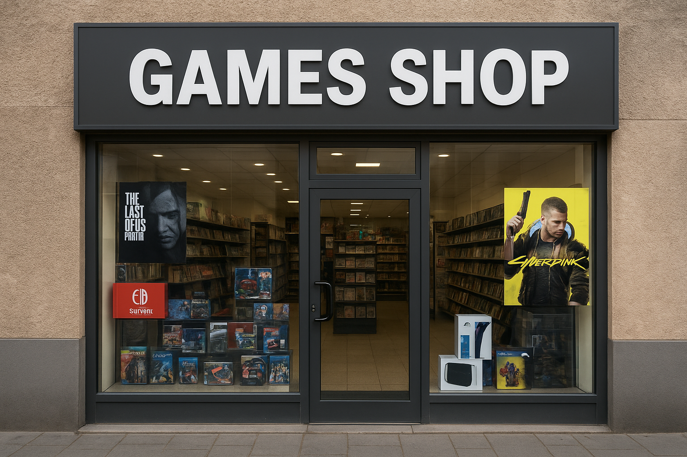

[JAVASCRIPT__BADGE]: https://img.shields.io/badge/Javascript-000?style=for-the-badge&logo=javascript
[HTML__BADGE]: https://img.shields.io/badge/HTML5-E34F26?style=for-the-badge&logo=html5&logoColor=white
[CSS__BADGE]: https://img.shields.io/badge/CSS3-1572B6?style=for-the-badge&logo=css3&logoColor=white
[PROJECT__BADGE]: https://img.shields.io/badge/📱Visit_this_project-000?style=for-the-badge&logo=project
[PROJECT__URL]: https://site-gamesshop-gamma-sable.vercel.app/

<h1 align="center" style="font-weight: bold;">Games Shop 🎮</h1>

![html][HTML__BADGE]
![css][CSS__BADGE]
![javascript][JAVASCRIPT__BADGE]

<details open="open">
<summary>Table of Contents</summary>
 
- [📌 About](#about)
- [🧠 Technologies Used](#technologies)
- [🚀 Getting started](#started)
  - [Prerequisites](#prerequisites)
  - [Cloning](#cloning)
  - [Starting](#starting)
- [📍 Application Sections](#routes)
- [🤝 How to reach me](#reach)
  
</details>

<p align="center">
    
</p>

<h2 id="about">📌 About</h2>

**Games Shop** is a fictional online store dedicated to the gaming world.  
It was created to practice **HTML**, **CSS**, and **JavaScript** fundamentals, focusing on responsive design, form validation, and semantic web structure.

The project simulates a simple e-commerce landing page that features information about the store, brand logos, contact forms with validation, and social media links.  

Its purpose is purely educational, helping reinforce front-end development skills with clean and organized code.

[![project][PROJECT__BADGE]][PROJECT__URL]

---

<h2 id="technologies">🧠 Technologies Used</h2>

This project was built using the following technologies:

- ![html][HTML__BADGE] — Page structure and semantic markup  
- ![css][CSS__BADGE] — Layout styling and responsive design  
- ![javascript][JAVASCRIPT__BADGE] — Dynamic form validation and interactivity  

---

<h2 id="started">🚀 Getting started</h2>

<h3>Prerequisites</h3>

You only need a web browser to run this project locally.  
(Optional) You can use a local server such as **Live Server** in VSCode.

<h3>Cloning</h3>

```bash
git clone https://github.com/monosodrac/games_shop.git
```

<h3>Starting</h3>

```
cd games_shop
# Open the index.html file directly in your browser
# or use VSCode Live Server to preview the page
```

<h2 id="routes">📍 Application Sections</h2>

| section            | description                                                     |
| ------------------ | --------------------------------------------------------------- |
| <kbd>Header</kbd>  | Contains navigation links to the “About” and “Contact” sections |
| <kbd>About</kbd>   | Introduces the store, its mission, and partner brands           |
| <kbd>Contact</kbd> | Includes a contact form with validation and social links        |
| <kbd>Footer</kbd>  | Displays copyright and current year                             |

<h2 id="reach">🤝 How to reach me</h2>

<table>
  <tr>
    <td align="center">
      <a href="https://linktr.ee/monosodrac">
        <br>
        <sub>
          <b>Mono</b>
        </sub>
      </a>
    </td>
  </tr>
</table>
